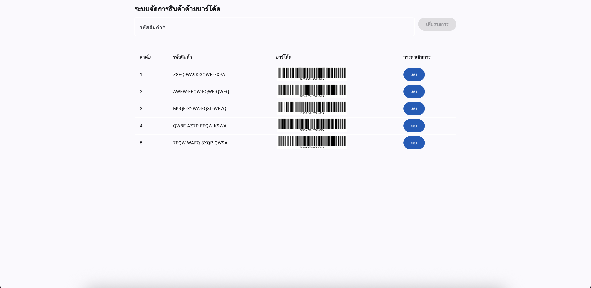
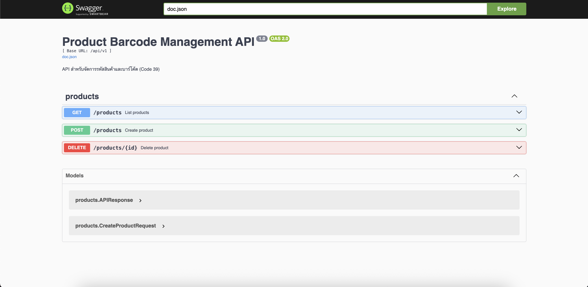

# Product Barcode Management

ระบบจัดการข้อมูลสินค้าด้วยบาร์โค้ด  
พัฒนาเพื่อแสดงความสามารถด้าน **Frontend (Angular)** และ **Backend (Golang)**  
เหมาะสำหรับใช้เป็น **Assignment / Technical Test / Portfolio**

---

## 📌 Overview

**Product Barcode Management** เป็นระบบสำหรับจัดการข้อมูลรหัสสินค้า  
รองรับการทำงานหลักดังนี้

- เพิ่มข้อมูลสินค้า
- แสดงรายการสินค้า
- ลบข้อมูลสินค้า

พร้อมแสดงบาร์โค้ดตามมาตรฐานที่กำหนด  
โครงสร้างโค้ดถูกออกแบบให้แยกความรับผิดชอบชัดเจน  
โดยยึดแนวคิด **Clean Architecture / Feature-based Structure**

---

## ✨ Features

### Product Management
- เพิ่มรหัสสินค้า
- แสดงรายการสินค้า
- ลบข้อมูลสินค้า

### Validation
- ตรวจสอบรูปแบบรหัสสินค้าอัตโนมัติ
  - ความยาว 16 ตัวอักษร
  - รูปแบบ `XXXX-XXXX-XXXX-XXXX`
  - รองรับเฉพาะอักษรภาษาอังกฤษตัวพิมพ์ใหญ่ (A–Z) และตัวเลข (0–9)
- Auto Uppercase และ Auto Format ระหว่างพิมพ์
- ปุ่ม **เพิ่มรายการ** จะถูกปิดใช้งานเมื่อข้อมูลไม่ถูกต้อง

### Barcode
- แสดงบาร์โค้ดตามมาตรฐาน **Code 39**

### UX / UI
- แสดงข้อมูลในรูปแบบตาราง
- ลบข้อมูลพร้อม Confirm Dialog
- อัปเดตข้อมูลแบบ Real-time (Optimistic UI)
- รูปแบบ Response ของ API เป็นมาตรฐานเดียวกันทั้งระบบ

---

## 🖥️ UI Preview

ตัวอย่างหน้าจอการใช้งานระบบ

  


---

## 🛠️ Tech Stack

### Frontend
- Angular (Standalone Components)
- Angular Material
- Reactive Forms
- TypeScript

### Backend
- Golang (net/http)
- Swagger (swaggo)
- In-memory Repository
- Docker / Docker Compose

### Barcode
- JsBarcode
- Barcode Standard: **Code 39**

---

## 📋 Business Rules / System Specification

- รหัสสินค้าต้องประกอบด้วยตัวอักษร A–Z และตัวเลข 0–9 เท่านั้น
- ความยาวรหัสสินค้า 16 ตัวอักษร
- รูปแบบรหัสสินค้า `XXXX-XXXX-XXXX-XXXX`
- ระบบแสดงบาร์โค้ดตามมาตรฐาน **Code 39**
- ไม่อนุญาตให้เพิ่มข้อมูลที่ไม่ถูกต้องตามรูปแบบที่กำหนด

---

## 📂 Project Structure

```text
product-barcode-management
├── backend
│   ├── cmd/api                # Application entry point
│   ├── docs                   # Swagger documentation
│   ├── internal
│   │   ├── app                # Router / API response
│   │   └── products           # Product feature
│   │       ├── handler.go
│   │       ├── service.go
│   │       ├── repo.go
│   │       ├── model.go
│   │       └── routes.go
│   ├── Dockerfile
│   ├── docker-compose.yml
│   ├── .env.example
│   ├── go.mod
│   └── go.sum
│
├── frontend
│   ├── src
│   │   ├── app
│   │   │   ├── components
│   │   │   │   └── confirm-dialog
│   │   │   └── pages
│   │   │       └── product
│   │   │           ├── product.component.ts
│   │   │           ├── product.component.html
│   │   │           ├── product.component.scss
│   │   │           └── product.api.ts
│   │   ├── app.routes.ts
│   │   ├── app.config.ts
│   │   └── main.ts
│   ├── proxy.conf.json
│   ├── angular.json
│   ├── package.json
│   └── package-lock.json
│
└── README.md
